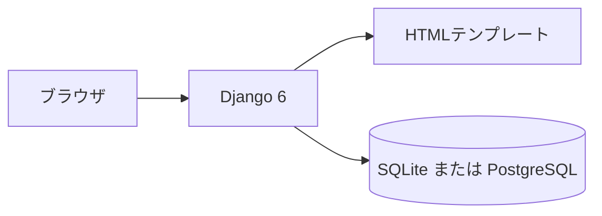
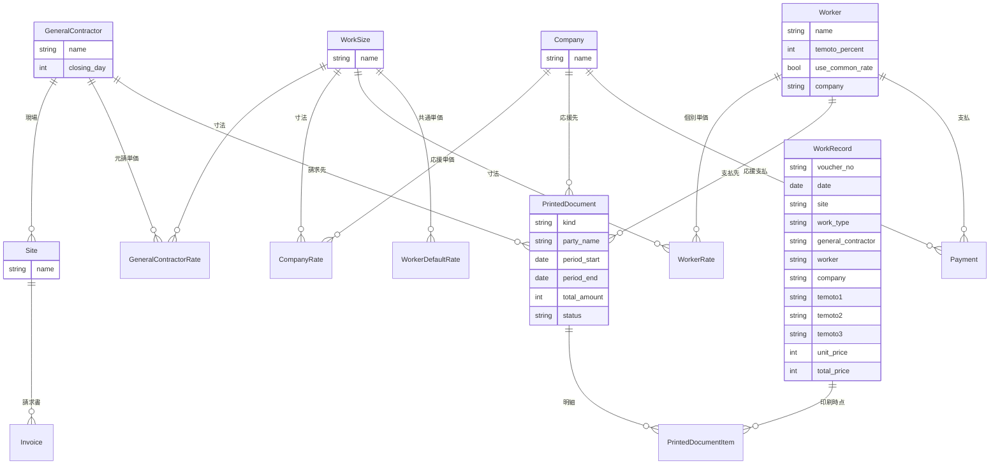
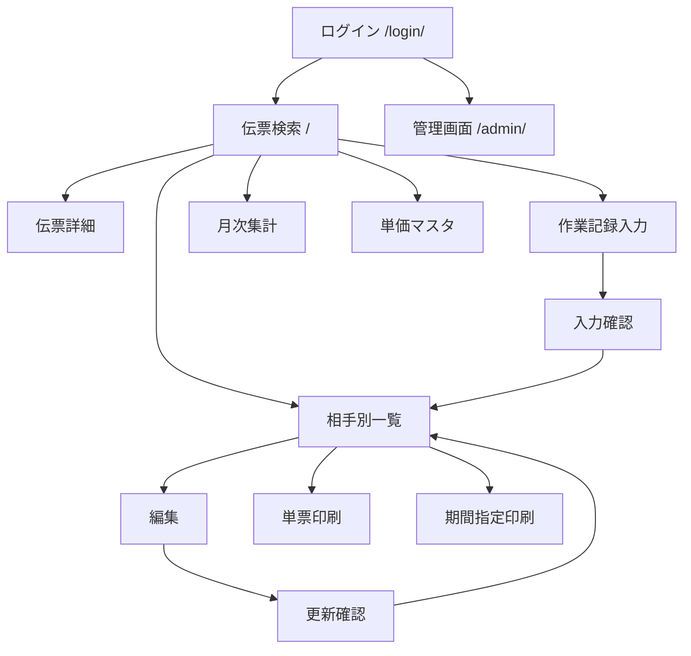

# 請求支払い入力

社内の事務・現場責任者向けに、日次の作業伝票を1画面で保存し、同じデータから元請の請求書と、職人・手元・応援の支払書を出すアプリです。

## デモ

公開サイトは [https://workapp-wx7x.onrender.com](https://workapp-wx7x.onrender.com) です。ログイン画面は [https://workapp-wx7x.onrender.com/login/](https://workapp-wx7x.onrender.com/login/) です。

無料プランのため、しばらくアクセスがないと停止します。最初の表示まで1分ほどかかることがあります。

| 項目 | 値 |
| --- | --- |
| デモURL | https://workapp-wx7x.onrender.com |
| ログインURL | https://workapp-wx7x.onrender.com/login/ |
| ユーザー名 | admin |
| パスワード | Render_root |

このアカウントは Django の管理者です。アプリ本体と、マスタ保守用の管理画面（`/admin/`）の両方にログインできます。

新規登録はログイン画面の「新規登録」（`/signup/`）から行います。招待コードが一致した人だけ登録でき、登録後はログインできます。コードは環境変数 `SIGNUP_INVITE_CODE` です。値はこの README には書きません。公開サイトでは Render の Environment に設定します。未設定のときは誰も登録できません。

架空のマスタと直近数日の伝票は、環境変数 `DEMO_SEED` が `1` のときだけ、まだ無い分を追加します。公開サイトでデモデータを入れる場合は、Render の Environment で `DEMO_SEED` を `1` にしてからデプロイします。未設定のときは何も追加しないので、業務データには混ざりません。既にある伝票は消して作り直しません。

ソースは GitHub にあります。

- https://github.com/admin1-creator/workapp

## 要件定義

### 背景と目的

圧接・鍛冶などの現場では、1枚の作業伝票から元請への請求と、職人・手元・応援への支払を作ります。相手ごとに単価と配分が違うため、同じ内容を4回入力すると金額がずれます。似た名前の現場も多いので、現場と元請をマスタで選ばせます。手元の割合は人数で決まっているので、手計算をやめて自動計算にします。

### 対象ユーザー

社内の事務担当と現場責任者だけが使います。元請・職人・応援企業向けの公開ログインはありません。ログイン済みの利用者は伝票の入力・確認・印刷ができます。マスタの追加や修正は、同じ管理者アカウントの Django 管理画面で行います。

### 実現すること

- 伝票番号、日付、現場、元請、1次企業、職人、手元（最大3人）、応援企業、作業内容（最大15行）を1画面で保存する
- 保存前に、元請・職人・手元・応援の単価と金額を確認する
- 相手（元請 / 職人 / 手元 / 応援）を選んで一覧し、編集・削除・印刷する
- 元請は請求書、職人・手元・応援は支払書として、1伝票または期間指定で印刷する
- 印刷した金額は、その時点の金額のまま固定する
- 元請の締め日に合わせて、締め対象期間と未請求件数を見る
- 当月の伝票を月次集計する

### 業務ルール

- 作業内容は1行以上必須。2行目以降で作業内容が空の行は、直前の作業内容を引き継ぐ
- 作業行は最大15行。手元は最大3人で、同じ人の重複選択はできない
- 手元0人の職人控除は 0%。1人は 35%。2人以上は 40%
- 2人の手元は 20% ずつ。3人の手元は 40% を人数で分割する
- 手元の個人％は手元の支払だけに使い、職人控除の率は変えない
- 単価はマスタから取る。職人は個別単価がなければ共通単価を使う
- 手入力のときは、請求・支払・応援の単価または金額を相手別に入れられる
- 割合の金額は切り捨て
- 印刷済みの伝票は、印刷を取り消すまで直接編集しない
- 印刷後に単価マスタを変えても、印刷済み書類の金額は変えない
- 消費税率は 10%

### 対象外

- 元請や職人自身がログインして伝票を見る機能
- 会計ソフトや銀行への送信
- 年月を指定する月次集計（当月固定）

## 主な機能一覧

- ログイン・ログアウト（社内利用者のみ。元請や職人への公開ログインはない）
- 伝票検索（日付、現場、伝票番号、相手）
- 伝票の1画面入力（伝票番号、日付、現場、元請、職人、手元最大3人、応援、作業最大15行）
- 保存前の確認（元請・職人・手元・応援の単価と金額）
- 単価の自動取得（元請単価、職人は個別単価がなければ共通単価、応援単価）
- 手元人数による職人控除と、手元個人％の支払への反映
- 相手別一覧（元請 / 職人 / 手元 / 応援）
- 編集、更新前の差分確認、削除
- 単票印刷
- 期間指定印刷（元請は請求書、職人・手元・応援は支払書）
- 印刷済みの表示と、印刷時点の金額の固定
- 元請の締め日と締め期間の表示
- 当月の月次集計
- 単価マスタ（元請、職人、手元％、応援）
- 管理画面でのマスタ保守（元請、現場、作業員、応援企業、寸法、作業種類、単価、印刷書類）

## 使用フレームワーク・ライブラリ

バージョンは `requirements.txt` と `.python-version` に合わせています。

| 名前 | バージョン | 用途 |
| --- | --- | --- |
| Python | 3.14.3 | 実行環境（`.python-version`） |
| Django | 6.0.6 | Web フレームワーク。画面、認証、管理画面、ORM |
| dj-database-url | 3.1.2 | `DATABASE_URL` から本番データベース設定を作る |
| psycopg2-binary | 2.9.13 | PostgreSQL 接続 |
| WhiteNoise | 6.12.0 | 本番の静的ファイル配信（brotli 付き） |
| Gunicorn | 26.2.0 | 本番のアプリサーバー（`start.sh`） |
| uvicorn | 0.54.0 | `requirements.txt` に含む。現在の起動コマンドでは使っていない |

画面は Django テンプレート、HTML、CSS、JavaScript です。独立したフロントエンドフレームワークは使っていません。検索可能な選択には、Django 管理画面に同梱されている jQuery と Select2 を静的ファイルとして使っています。

### インフラ

- 本番: [Render](https://render.com/) の Web Service と PostgreSQL
- 開発: Django の開発サーバー（`runserver`）と SQLite（`db.sqlite3`）
- バージョン管理: Git / GitHub（`main`）
- テスト: Django の `TestCase`（`workapp/tests.py`）
- デプロイ定義: `render.yaml`、`build.sh`、`start.sh`

## 外部API

このアプリは、天気・地図・決済などの他社 API を呼び出していません。

寸法を変えたときの単価取得だけ、ブラウザがこのアプリ自身の URL を呼びます。外部サービスではなく、ログイン済み利用者向けの内部エンドポイントです。

| 項目 | 内容 |
| --- | --- |
| URL | `/get_unit_price/` |
| メソッド | GET |
| 認証 | ログイン必須 |
| クエリ | `type`（`contractor` / `worker` / `company`）、`id`（元請・職人・応援企業の ID）、`size`（寸法 ID） |
| 応答 | JSON。`{"unit_price": 数値}` または `{"unit_price": null}` |

## 構成

ブラウザが Django にリクエストし、テンプレートを返します。開発中のデータは SQLite、Render 上のデータは PostgreSQL に保存します。



## データベース設計

マスタ（元請、現場、作業員、応援企業、寸法、単価）は外部キーでつながります。作業記録は入力時点の名称を文字で持ちます。印刷書類は相手マスタと作業記録を参照し、印刷時点の行金額を明細に固定します。



作業記録の現場・元請・職人・応援・手元は、保存時点の名称を文字カラムで持っています。

## 画面遷移

ログイン後の入口は伝票検索です。新規入力は確認を経て保存し、一覧から編集・印刷へ進みます。



| 画面 | URL |
| --- | --- |
| ログイン | `/login/` |
| 伝票検索 | `/` |
| 伝票詳細 | `/workrecord/voucher/<id>/` |
| 作業記録入力 | `/workrecord/create/` |
| 入力確認 | `/workrecord/review/` |
| 相手別一覧 | `/workrecord/list/` |
| 編集 | `/workrecord/edit/<id>/` |
| 更新確認 | `/workrecord/confirm/` |
| 単票印刷 | `/workrecord/<id>/print/` |
| 期間指定印刷 | `/workrecord/print/period/` |
| 月次集計 | `/monthly/` |
| 元請単価 | `/unit/moto/` |
| 職人単価 | `/unit/shokunin/` |
| 手元設定 | `/unit/temoto/` |
| 応援単価 | `/unit/ouen/` |
| 管理画面 | `/admin/` |

## ローカル開発環境の構築手順

Python 3.14 系が必要です。リポジトリの直下に `manage.py` があります。

```powershell
git clone https://github.com/admin1-creator/workapp.git
cd workapp
python -m venv .venv
.venv\Scripts\Activate.ps1
python -m pip install -r requirements.txt
python manage.py migrate
python manage.py createsuperuser
python manage.py runserver
```

ブラウザで http://127.0.0.1:8000/login/ を開き、`createsuperuser` で作ったユーザー名とパスワードでログインします。

元請、現場、作業員、寸法、単価は管理画面（http://127.0.0.1:8000/admin/）で登録してから伝票を入力します。

テストを実行する場合:

```powershell
python manage.py test workapp
```

## Render へのデプロイ

手順の詳細は [Deploy a Django App on Render](https://render.com/docs/deploy-django) に沿っています。リポジトリには次のファイルを置いてあります。

- `requirements.txt` … 本番で使う Python パッケージ
- `build.sh` … デプロイのたびにパッケージ導入、静的ファイル収集、マイグレーションを実行
- `render.yaml` … Web サービスと PostgreSQL の定義
- `.python-version` … Python 3.14.3

公開サイトのログインは、上のデモアカウントを使います。本番データベースは手元の SQLite とは別なので、ローカルの伝票は自動ではコピーされません。

公開URLへ修正を載せるには、GitHub の `main` に push したあと、Render の web サービス `workapp` で Manual Deploy → Deploy latest commit を実行します。そのデプロイが Live になるまで、公開サイトは前の版のままです。
