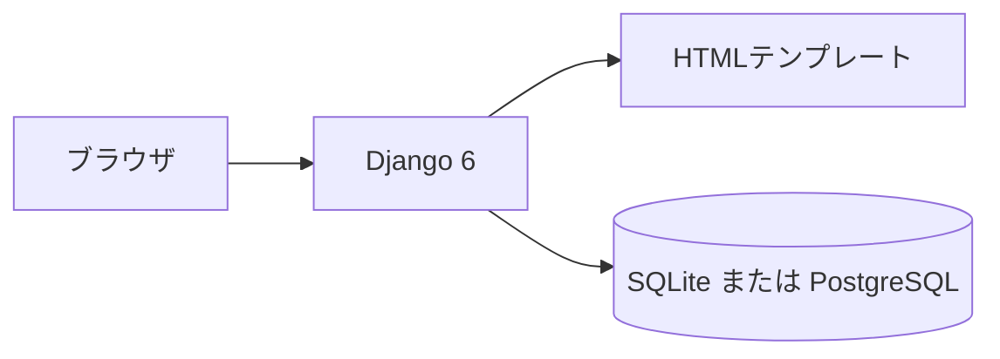
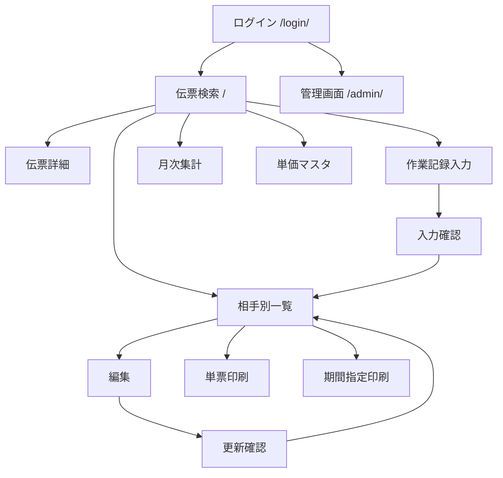

# 請求支払い入力

社内の事務・現場責任者向けに、日次の作業伝票を1画面で保存し、同じデータから元請の請求書と、職人・手元・応援の支払書を出すアプリです。

## アプリ名

請求支払い入力

## アプリURL

公開URLは、Render へデプロイしたあとに `https://<サービス名>.onrender.com` として発行されます。手元では次のアドレスで開きます。

- アプリ: http://127.0.0.1:8000/
- ログイン: http://127.0.0.1:8000/login/
- 管理画面: http://127.0.0.1:8000/admin/

ソースは GitHub にあります。

- https://github.com/admin1-creator/workapp

固定のテスト用ID／パスワードはリポジトリに入れていません。起動手順の `createsuperuser` で作ったアカウントでログインします。

## 概要

圧接・鍛冶などの現場で、元請への請求と、職人・手元・応援への支払を、1枚の作業伝票から作る社内アプリです。相手ごとに単価と配分が違うため、入力を分けると金額がずれます。1回の保存で4者分の金額を計算し、相手と期間を指定して請求書・支払書を印刷します。

## 制作背景・目的

紙の作業日報と Excel、会計ソフトの請求機能では、次の現場ルールに合いません。

- 元請ごとに締め日が違う
- 手元の人数で職人の支払から控除する（手元0人は0%、1人は35%、2人以上は40%）
- 手元への加算％は人によって違い、支払側だけに使う

自社の請求日と配分計算に合わせて、伝票入力から相手別の帳票までを一つの画面の流れにまとめるために作りました。一般公開、課金、会計ソフト連携、勤怠打刻は対象外です。

## 主な機能一覧

- ログイン・ログアウト（社内利用者のみ。元請や職人への公開ログインはない）
- 伝票検索（日付、現場、伝票番号、相手）
- 伝票の1画面入力（伝票番号、日付、現場、元請、職人、手元最大3人、応援、作業最大15行）
- 保存前の確認（元請・職人・手元・応援の単価と金額）
- 単価の自動取得（元請単価、職人は個別単価がなければ共通単価、応援単価）
- 手元人数による職人控除と、手元個人％の支払への反映
- 相手別一覧（元請 / 職人 / 手元 / 応援）
- 編集、更新前の差分確認、削除
- 単票印刷
- 期間指定印刷（元請は請求書、職人・手元・応援は支払書）
- 印刷済みの表示と、印刷時点の金額の固定
- 元請の締め日と締め期間の表示
- 当月の月次集計
- 単価マスタ（元請、職人、手元％、応援）
- 管理画面でのマスタ保守（元請、現場、作業員、応援企業、寸法、作業種類、単価、印刷書類）

## 使用技術

### フロントエンド

- HTML
- CSS（画面ごとのテンプレート内スタイル）
- JavaScript（寸法変更時の単価取得、検索可能な選択）
- Django テンプレート

独立したフロントエンドフレームワークは使っていません。

### バックエンド

- Python 3.12 以上
- Django 6.0
- Django 標準の認証（`login_required`）

### インフラ・サーバー

- 本番: [Render](https://render.com/) の Web Service（Gunicorn + Uvicorn）
- 開発: Django の開発サーバー（`runserver`）

### データベース

- 本番: Render PostgreSQL（接続先は環境変数 `DATABASE_URL`）
- 開発: SQLite（`db.sqlite3`）

### その他

- バージョン管理: Git / GitHub（`main`）
- 静的ファイル: WhiteNoise
- マスタ保守: Django 管理画面
- テスト: Django の `TestCase`（`workapp/tests.py`）
- デプロイ定義: `render.yaml`、`build.sh`
- 外部API、コンテナ構成は未使用

## 構成

ブラウザが Django にリクエストし、テンプレートを返します。開発中のデータは SQLite、Render 上のデータは PostgreSQL に保存します。



## データベース設計

マスタ（元請、現場、作業員、応援企業、寸法、単価）は外部キーでつながります。作業記録は入力時点の名称を文字で持ちます。印刷書類は相手マスタと作業記録を参照し、印刷時点の行金額を明細に固定します。


作業記録の現場・元請・職人・応援・手元は、保存時点の名称を文字カラムで持っています。

## 画面遷移

ログイン後の入口は伝票検索です。新規入力は確認を経て保存し、一覧から編集・印刷へ進みます。



| 画面 | URL |
| --- | --- |
| ログイン | `/login/` |
| 伝票検索 | `/` |
| 伝票詳細 | `/workrecord/voucher/<id>/` |
| 作業記録入力 | `/workrecord/create/` |
| 入力確認 | `/workrecord/review/` |
| 相手別一覧 | `/workrecord/list/` |
| 編集 | `/workrecord/edit/<id>/` |
| 更新確認 | `/workrecord/confirm/` |
| 単票印刷 | `/workrecord/<id>/print/` |
| 期間指定印刷 | `/workrecord/print/period/` |
| 月次集計 | `/monthly/` |
| 元請単価 | `/unit/moto/` |
| 職人単価 | `/unit/shokunin/` |
| 手元設定 | `/unit/temoto/` |
| 応援単価 | `/unit/ouen/` |
| 管理画面 | `/admin/` |

## ローカル開発環境の構築手順

Python 3.12 以上が必要です。リポジトリの直下に `manage.py` があります。

```powershell
git clone https://github.com/admin1-creator/workapp.git
cd workapp
python -m venv .venv
.venv\Scripts\Activate.ps1
python -m pip install -r requirements.txt
python manage.py migrate
python manage.py createsuperuser
python manage.py runserver
```

ブラウザで http://127.0.0.1:8000/login/ を開き、`createsuperuser` で作ったユーザー名とパスワードでログインします。

元請、現場、作業員、寸法、単価は管理画面（http://127.0.0.1:8000/admin/）で登録してから伝票を入力します。

テストを実行する場合:

```powershell
python manage.py test workapp
```

## Render へのデプロイ

手順の詳細は [Deploy a Django App on Render](https://render.com/docs/deploy-django) に沿っています。リポジトリには次のファイルを置いてあります。

- `requirements.txt` … 本番で使う Python パッケージ
- `build.sh` … デプロイのたびにパッケージ導入、静的ファイル収集、マイグレーションを実行
- `render.yaml` … Web サービスと PostgreSQL の定義
- `.python-version` … Python 3.14.3

この変更を GitHub の `main` に push したあと、Render の Dashboard で Blueprint を作成します。公開後のログインユーザーは、Render の Shell で `python manage.py createsuperuser` を実行して作ります。本番データベースは空の状態から始まるので、手元の SQLite の伝票は自動ではコピーされません。
